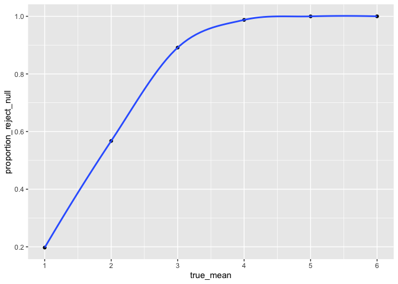
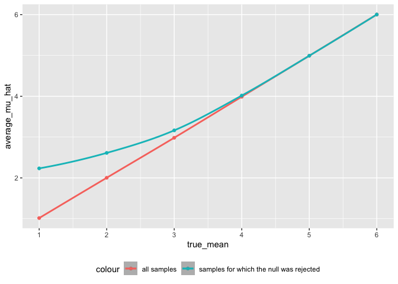

p8105_hw5_fz2328
================
Fengdi Zhang
2022-11-15

## Problem 2

Import Data:

``` r
homicides_US = read_csv("homicide-data.csv") %>% 
  janitor::clean_names() 
```

The dataset includes 12 variables, including city, disposition, lat,
lon, reported_date, state, uid, victim_age, victim_first, victim_last,
victim_race, victim_sex. There are 52179 observations in total.

Let’s look at the total number of homicides and the number of unsolved
homicides for each city.

``` r
homicides_US = 
  homicides_US %>% 
  mutate(city_state = str_c(city, state, sep = ","))

total_and_unsolved = homicides_US %>% 
    group_by(city_state) %>% 
    mutate(
      desposition_log1 = ifelse(disposition == "Closed without arrest", 1, 0),
      desposition_log2 = ifelse(disposition == "Open/No arrest", 1, 0)) %>% 
  summarise(
    total_n_homicides = n(),
    N_unsolved_homicides = sum(desposition_log1) + sum(desposition_log2)
  )

total_and_unsolved %>% knitr::kable()
```

| city_state        | total_n\_homicides | N_unsolved_homicides |
|:------------------|-------------------:|---------------------:|
| Albuquerque,NM    |                378 |                  146 |
| Atlanta,GA        |                973 |                  373 |
| Baltimore,MD      |               2827 |                 1825 |
| Baton Rouge,LA    |                424 |                  196 |
| Birmingham,AL     |                800 |                  347 |
| Boston,MA         |                614 |                  310 |
| Buffalo,NY        |                521 |                  319 |
| Charlotte,NC      |                687 |                  206 |
| Chicago,IL        |               5535 |                 4073 |
| Cincinnati,OH     |                694 |                  309 |
| Columbus,OH       |               1084 |                  575 |
| Dallas,TX         |               1567 |                  754 |
| Denver,CO         |                312 |                  169 |
| Detroit,MI        |               2519 |                 1482 |
| Durham,NC         |                276 |                  101 |
| Fort Worth,TX     |                549 |                  255 |
| Fresno,CA         |                487 |                  169 |
| Houston,TX        |               2942 |                 1493 |
| Indianapolis,IN   |               1322 |                  594 |
| Jacksonville,FL   |               1168 |                  597 |
| Kansas City,MO    |               1190 |                  486 |
| Las Vegas,NV      |               1381 |                  572 |
| Long Beach,CA     |                378 |                  156 |
| Los Angeles,CA    |               2257 |                 1106 |
| Louisville,KY     |                576 |                  261 |
| Memphis,TN        |               1514 |                  483 |
| Miami,FL          |                744 |                  450 |
| Milwaukee,wI      |               1115 |                  403 |
| Minneapolis,MN    |                366 |                  187 |
| Nashville,TN      |                767 |                  278 |
| New Orleans,LA    |               1434 |                  930 |
| New York,NY       |                627 |                  243 |
| Oakland,CA        |                947 |                  508 |
| Oklahoma City,OK  |                672 |                  326 |
| Omaha,NE          |                409 |                  169 |
| Philadelphia,PA   |               3037 |                 1360 |
| Phoenix,AZ        |                914 |                  504 |
| Pittsburgh,PA     |                631 |                  337 |
| Richmond,VA       |                429 |                  113 |
| Sacramento,CA     |                376 |                  139 |
| San Antonio,TX    |                833 |                  357 |
| San Bernardino,CA |                275 |                  170 |
| San Diego,CA      |                461 |                  175 |
| San Francisco,CA  |                663 |                  336 |
| Savannah,GA       |                246 |                  115 |
| St. Louis,MO      |               1677 |                  905 |
| Stockton,CA       |                444 |                  266 |
| Tampa,FL          |                208 |                   95 |
| Tulsa,AL          |                  1 |                    0 |
| Tulsa,OK          |                583 |                  193 |
| Washington,DC     |               1345 |                  589 |

Now let’s look at the proportion of homicides that are unsolved in
Baltimore,MD.

``` r
Bal_ptest = 
  total_and_unsolved %>%
  filter(city_state == "Baltimore,MD") %>% 
  mutate(p_test = prop.test(N_unsolved_homicides, total_n_homicides) %>% 
           broom::tidy()) %>% 
  unnest() %>% 
  select(city_state, estimate, conf.low, conf.high)

Bal_ptest %>% knitr::kable()
```

| city_state   |  estimate |  conf.low | conf.high |
|:-------------|----------:|----------:|----------:|
| Baltimore,MD | 0.6455607 | 0.6275625 | 0.6631599 |

Run `Prop.test` for each of the cities.

``` r
prop_test = function(df) {
  p_test = prop.test(df$N_unsolved_homicides, df$total_n_homicides) %>% 
           broom::tidy() %>% 
           unnest() %>% 
           select(estimate, conf.low, conf.high)
  
  p_test
}

allcity_ptest = 
  total_and_unsolved %>% 
  nest(data = total_n_homicides:N_unsolved_homicides) %>% 
  mutate(p_test = map(data, prop_test)) %>% 
  unnest(data, p_test)
```

Make a plot to visualize the proportion of unsolved homicides for each
city.

``` r
allcity_ptest %>% 
  mutate(city_state = fct_reorder(city_state, estimate)) %>%  
  ggplot(aes(x = city_state, y = estimate)) + 
  geom_point() +
  geom_errorbar(aes(ymin = conf.low, ymax = conf.high), width = 1) + 
  theme(axis.text.x = element_text(angle = 90, vjust = 0.7))
```

<!-- -->

## Problem 3

Generate 5000 datasets from the model x \~ Normal\[0, 50\]

``` r
sim_mean = function(n_obs = 30, mu, sigma = 5) {
    
  x = rnorm(n_obs, mean = mu, sd = sigma)
  
  x}


sim_results_df = 
  expand_grid(
    true_mean = 0,
    iter = 1:5000
  ) %>% 
  mutate(
    estimate_df = map(true_mean, ~ sim_mean(mu = .x)),
    t_test = map(estimate_df, ~ t.test(x = .x) %>% 
          broom::tidy()) 
  ) %>% 
  unnest(t_test) %>% 
  mutate(mu_hat = estimate,
        p_value = p.value) %>% 
  select(true_mean, iter, mu_hat, p_value)

head(sim_results_df)
```

    ## # A tibble: 6 × 4
    ##   true_mean  iter  mu_hat p_value
    ##       <dbl> <int>   <dbl>   <dbl>
    ## 1         0     1  1.15     0.188
    ## 2         0     2  1.36     0.203
    ## 3         0     3 -0.311    0.734
    ## 4         0     4 -0.970    0.306
    ## 5         0     5  0.0745   0.927
    ## 6         0     6  0.995    0.256

let’s repeat it for mu = {1,2,3,4,5,6}.

``` r
all_mean_sim = expand_grid(
    true_mean = c(1, 2, 3, 4, 5, 6),  
    iter = 1:5000
  ) %>% 
  mutate(
    estimate_df = map(true_mean, ~ sim_mean(mu = .x)),
    t_test = map(estimate_df, ~ t.test(x = .x) %>% 
          broom::tidy()) 
  ) %>% 
  unnest(t_test) %>% 
  mutate(mu_hat = estimate,
        p_value = p.value) %>% 
  select(true_mean, iter, mu_hat, p_value)

head(all_mean_sim)
```

    ## # A tibble: 6 × 4
    ##   true_mean  iter mu_hat p_value
    ##       <dbl> <int>  <dbl>   <dbl>
    ## 1         1     1 0.601    0.493
    ## 2         1     2 0.262    0.784
    ## 3         1     3 1.09     0.278
    ## 4         1     4 0.724    0.381
    ## 5         1     5 0.689    0.549
    ## 6         1     6 0.0472   0.959

Let’s look at the proportion of times the null was rejected for each
true_mean group.

``` r
proportion_reject_null =
  all_mean_sim %>% 
  mutate(reject_null = ifelse(p_value < 0.05 | p_value == 0.05, 1, 0)) %>% 
  group_by(true_mean) %>% 
  summarise(proportion_reject_null = sum(reject_null)/5000)

proportion_reject_null %>% 
  ggplot(aes(x = true_mean, y = proportion_reject_null)) + 
  geom_point() +
  geom_smooth()+
  scale_x_continuous(breaks = c(0, 1, 2, 3, 4, 5, 6))
```

<!-- --> We
can see that the the power increase as the true_mean increase, implying
that effect size and power are positively associated.

Let’s look at the average estimate of mu_hat.

``` r
average_mu_hat = 
  all_mean_sim %>%
  mutate(reject_null = ifelse(p_value < 0.05 | p_value == 0.05, 1, 0)) %>% 
  group_by(true_mean) %>%
  summarise(average_mu_hat = mean(mu_hat), 
            average_mu_hat_reject = mean(mu_hat[reject_null == 1]))


average_mu_hat %>% 
  ggplot(aes(x = true_mean)) +
  geom_point(aes(y = average_mu_hat, color = "all samples")) + 
  geom_smooth(aes(y = average_mu_hat, color = "all samples")) +
  geom_point(aes(y = average_mu_hat_reject, color = "samples for which the null was rejected")) +
  geom_smooth(aes(y = average_mu_hat_reject, color = "samples for which the null was rejected")) +
  scale_x_continuous(breaks = c(0, 1, 2, 3, 4, 5, 6)) +
  theme(legend.position = "bottom")
```

<!-- -->

The sample average of mu_hat across tests for which the null is rejected
approximately equal to the true value of mu when the true_mean is
greater than or equal to 4, but they are not equal when the true_mean is
less than 4. This is because the power of the test is the greatest when
the true_mean is greater than or equal to 4, meaning that the
proportions of times the null was rejected are large, so the average of
mu_hat across tests for which the null is rejected would approximate the
true_mean.
